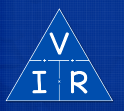
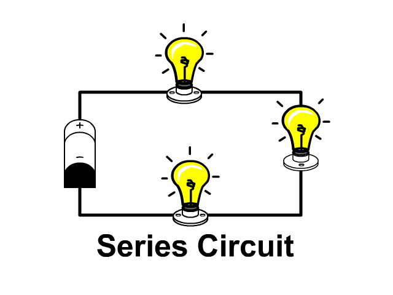
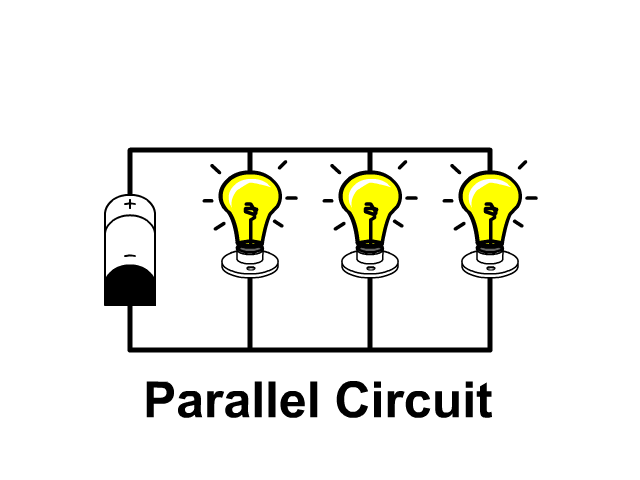

# Final Project for "Dasar Pemrograman"


## Group Identity
Group: **3**

| No | Name | Student ID | Study Program |
|----|------|-------------|----------------|
| 1  | Sabina Cheerly Nadapdap |5022251090| Electrical Engineering |
| 2  | Benjamin Cassius iwan |5022251088 | Electrical Engineering |
| 3  | Narendra Andhi Putra Pratama | 5022251034 | Electrical Engineering |

**Lecturer: Pak Arta** 

---

## Project Description

This program is a C-based application developed as the Final Project for the **Basic Programming** course at Institut Teknologi Sepuluh Nopember. The application functions as an **Electrical Calculator Kit**, offering a collection of electrical calculation tools and number conversion utilities.

The main features of the application include:

1. **Electrical Calculations**, such as:
   - Ohm’s Law (voltage, current, resistance)
   - Electrical power calculation
   - Series resistance total calculation
   - Parallel resistance total calculation

2. **Number Conversions**, including:
   - Decimal to binary
   - Decimal to octal
   - Octal to decimal
   - Hexadecimal to decimal

All inputs are validated to prevent errors, ensuring the program runs safely and reliably.

---

## Project Objective

This project is created to fulfill the final task of the **Basic Programming** course, with the following goals:

- Implement basic programming concepts in the C language.
- Develop a modular, menu-based interactive application.
- Apply control structures, functions, input validation, and arithmetic operations.
- Build a practical program useful particularly in the field of electrical engineering.

---

## Program Menu Structure

### Main Menu
1. **Circuits Calculator**
2. **Number Conversion Calculator**

### Circuits Calculator Menu
1. Ohm’s Law  
2. Power Calculation  
3. Series Resistance  
4. Parallel Resistance

### Number Conversion Calculator Menu
1. Decimal to Other Forms
2. Other Bases to Decimal

### Decimal to Other Bases Menu
1. Decimal to Binary  
2. Decimal to Octal  
3. Decimal to Hexadecimal

### Other Bases to Decimal Menu
1. Binary to Decimal
2. Octal to Decimal
3. Hexadecimal to Decimal

# Function Documentation

## List Function

```c
   void ohmsLaw();
   void decToBin();
   void decToOct();
   void decToHex();
   void octToDec();
   void hexToDec();
   void clearScreen();
   void power();
   void series();
   void parallel();
   void hexToDec();
   void binToDec();
```

## 1. `clearScreen()`
Clears the terminal screen for a cleaner program interface.  
- On Windows use `cls`  
- On Linux/Mac use `clear`

---

## 2. Electrical Calculation Functions

### a. `ohmsLaw()`

<p align="center">
  
  <p align = "center" >
      <i>Ohm's Triangle</i>
  </p>
</p>

Used to calculate:
- **Voltage** (V = I × R)  
- **Current** (I = V / R)  
- **Resistance** (R = V / I)

Features:
- Full input validation (no negative current or resistance values).  
- Handles special cases such as short circuit (R = 0) and open circuit (I = 0).  
- Displays results clearly with proper formatting.

---

### b. `power()`
Calculates **electrical power (P = V × I)**.  
Inputs include voltage (Volts) and current (Amperes).  
Input validation ensures only valid numeric inputs are processed.

---

### c. `series()`
<p align="center">
  
  <p align = "center" >
      <i>Series Circuit Picture</i>
  </p>
</p>
Calculates **total series resistance** by summing all resistors:  
R_total = R1 + R2 + … + Rn


Features:
- Accepts the number of resistors.  
- Allows entering multiple resistor values.  
- Prevents invalid inputs such as a non-positive number of resistors.

---

### d. `parallel()`

<p align="center">
  
  <p align = "center" >
      <i>Parallel Circuit Picture</i>
  </p>
</p>
Calculates **total parallel resistance**:

1/R_total = 1/R1 + 1/R2 + … + 1/Rn

Features:
- Processes an array of resistor values.  
- Prevents division by zero through proper input validation.

---

## 3. Number Conversion Functions

### a. `decToBin()`
Converts a decimal number to **binary**:
- Uses a remainder array to store computed bits.  
- Prints bits in reverse order for correct binary representation.  
- Handles zero input properly.

---

### b. `decToOct()`
Converts a decimal number to **octal**:
- Uses repeated division by 8.  
- Handles zero input and invalid values.

---

### c. `octToDec()`
Converts an octal number to decimal:
- Strict validation ensures digits do not exceed 7.  
- Computes values based on digit position and powers of 8.

---

### d. `hexToDec()`
Converts a hexadecimal number to decimal:
- Accepts digits 0–9, A–F, and a–f.  
- Converts characters into their numeric values.  
- Rejects invalid characters outside base-16 rules.

---

## Compilation and Execution

### Compile
```bash
gcc main.c -o electrical_calculator
```

### Run
```bash
./electrical_calculator.exe
```

---

## Initial Display
```terminator
===<<< Electrical Calculator Kit >>>====
[1] Circuits Calculator
[2] Number Conversion Calculator
Press 0 to Exit
```

## Sample Output Circuit Calculators
```
====<<< Electrical Calculator Kit >>>====
1.  Ohm`s Law
2.  Power
3.  Series
4.  Parallel
Press 0 to enter previous menu
```

```
====== Ohm's Law =======
[1] Find Voltage (V)
[2] Find Current (I)
[3] Find Resistance (R)
Enter your choice (1/2/3): 
```

```
======= Ohm's Law =======
Calculating Voltage Across a Resistor
Enter Current (I) in Amperes: 12
Enter Resistance value (Ohms): 14
The voltage across a 14.00 Ohm resistor with 12.00 A current is: 168.00 V
Do you want to try again? (y/n): y
```


## Sample Output Number Conversion

```
====<<< Number Conversion Calculator Kit >>>====
1.  Decimal to other forms
2.  Binary To Decimal
3.  Oktal to decimal
4.  Hexadecimal to decimal
Press 0 to enter previous menu
```
```
====<<< Number Conversion Calculator Kit >>>====
1.  Decimal to Binary
2.  Decimal to Octal
3.  Decimal to Hexadecimal 
Press 0 to enter previous menu
```

```
====================================
             DEC TO BINARY          
====================================

Insert a Decimal Number here: 123

Binary: 1111011

again? (y/n) : y
```

```
=====================================
             HEX TO DECIMAL          
=====================================

Enter hexadecimal number : 1F5

Decimal value : 501

Convert another? (y/n) : y
```

```
====================================
          OCTAL TO DECIMAL          
====================================

Input your octal number: 123

Decimal value of 123 (base 8) is: 83

Do you want to convert again? (y/n): y
```
---